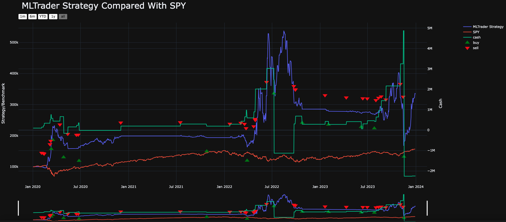
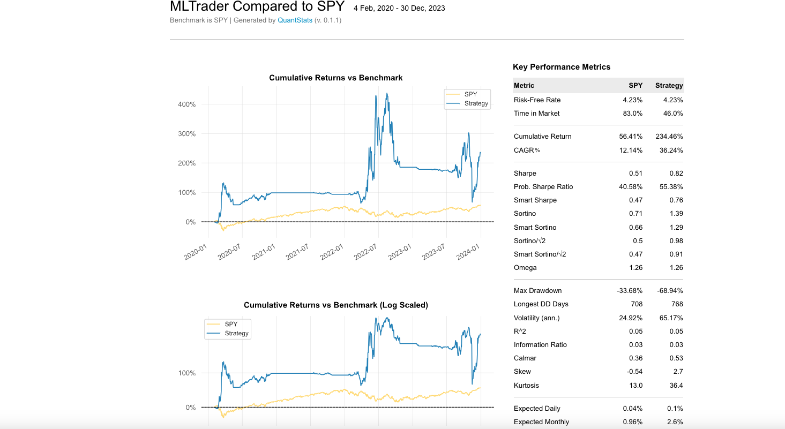

# 📈 MLTrader: AI-Powered Sentiment-Based Trading Bot

## 📌 Overview

MLTrader is an algorithmic trading bot that leverages **natural language processing (NLP) sentiment analysis** to make trading decisions. It fetches financial news, determines sentiment, and executes trades using the **Alpaca API**. The strategy is backtested with **Yahoo Finance data**.

## ⚡ Features

- **Sentiment-Based Trading**: Uses `finbert_utils` to estimate market sentiment from news.
- **Alpaca Integration**: Executes trades using Alpaca's brokerage API.
- **Backtesting**: Tests the strategy on historical data from Yahoo Finance.
- **Position Sizing**: Dynamically adjusts trade size based on available cash.
- **Risk Management**: Uses **bracket orders** with take-profit and stop-loss levels.

---

## 🛠 Installation & Setup

### 1️⃣ **Clone the Repository**

```
git clone https://github.com/your-repo/mltrader.git
cd mltrader
```

2️⃣ Create and Activate a Virtual Environment

```sh
python3 -m venv myenv
source myenv/bin/activate  # macOS/Linux
```

3️⃣ Install Dependencies
pip install -r requirements.txt

4️⃣ Set Up Your .env File
Create a .env file in the root directory with your Alpaca API credentials:

```
API_KEY=your_api_key
API_SECRET=your_api_secret
BASE_URL=https://paper-api.alpaca.markets
```

🚀 Usage

✅ Run the Backtest

```
python tradingbot.py
```

💡 Final app




